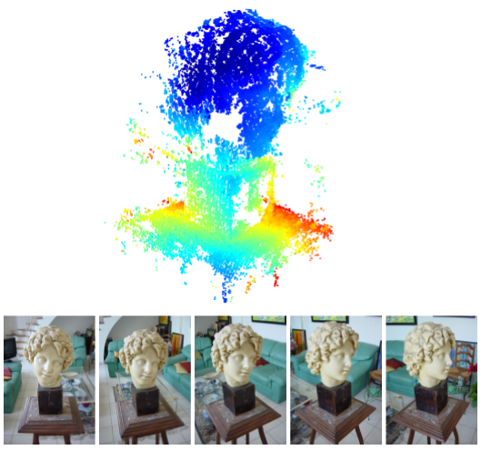

# Structure from Motion

Structure from motion is inspired by our ability to learn about the 3D structure in the surrounding environment by moving through it. Given a sequence of images, we are able to simultaneously estimate both the 3D structure and the path the camera took.

SfM can be solved using either Factorization Method or Algebraic Method. Some of the drawbacks of the Factorization Method are:, (1) It assumes that the 3D points are visible in all cameras. (2) It assumes Affine Cameras and therefore, there exists affine ambiguity in the solution in addition to similarity ambiguity.

In Algebraic Method, we assuming a projective camera and then solve for camera poses and 3D points using non-linear optimization for bundle adjustment. We first compute Fundamental Matrix and then use it to find out 4 possible pairs of R,T for each pair of cameras. For each pair of R,T, we then compute the linear estimate of 3D points which is further refined using bundle adjustment for minimizing reprojection errors between pairwise cameras with non-linear optimization method (Gauss-Newton). These 3D points can further be used to filter the best R,T, by enforcing the criteria that all the points should be ahead of camera planes.